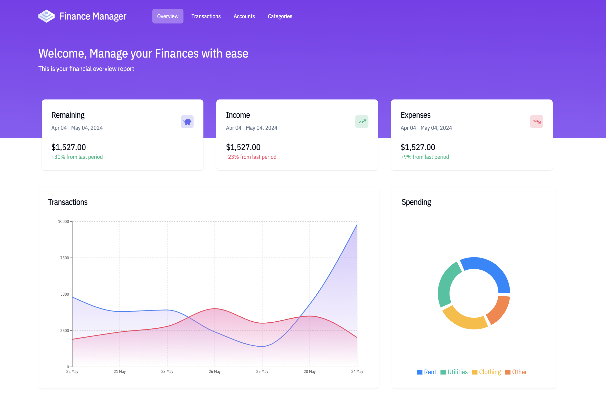
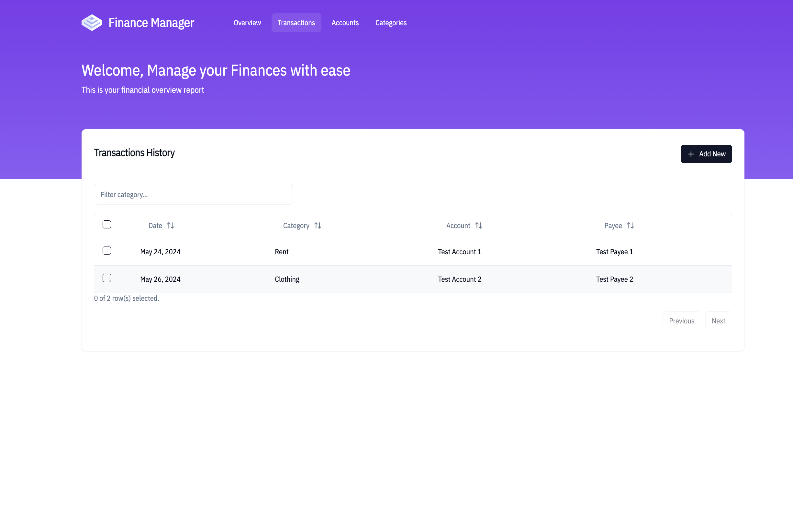
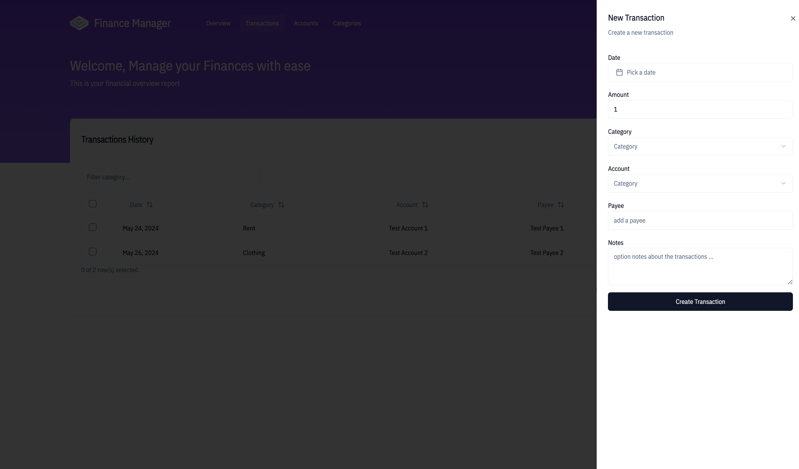

Manage your finances with ease by using our finance manager app. 

## Getting Started
Clone the repo to run the app locally

First, run the development server:

```bash
npm run dev
# or
yarn dev
# or
pnpm dev
# or
bun dev
```

Open [http://localhost:3000](http://localhost:3000) with your browser to see the result.

You can start editing the page by modifying `app/page.tsx`. The page auto-updates as you edit the file.

This project uses [`next.js v14`](https://nextjs.org).

### Images
- Dashboard / Overview

- Transactions page (Accounts and Categories pages uses same setup )

- Add Transaction Modal


